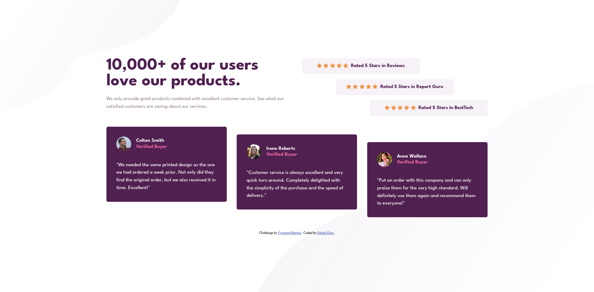

# Frontend Mentor - Social proof section solution

This is a solution to the [Social proof section challenge on Frontend Mentor](https://www.frontendmentor.io/challenges/social-proof-section-6e0qTv_bA).

## Table of contents

- [Overview](#overview)
  - [The challenge](#the-challenge)
  - [Screenshot](#screenshot)
  - [Links](#links)
- [My process](#my-process)
  - [Built with](#built-with)
  - [Continued development](#continued-development)
- [Author](#author)

## Overview

### The challenge

Users should be able to:

- View the optimal layout for the section depending on their device's screen size

### Screenshot
Desktop:

<!-- mobile:
 -->

### Links

- [Solution URL:](https://github.com/RafisElias/social-proof-section)
- [Live Site URL:](https://jazzy-melba-629cb0.netlify.app/)

## My process

### Built with

- Semantic HTML5 markup
- CSS custom properties
- Flexbox
- Grid layout
- Mulitples background images

### Continued development

- Clean my css, I think I didn't make my css the most efficient 

## Author

- Frontend Mentor - [@RafisElias](RafisElias)
- Twitter - [@rrprates](https://twitter.com/rrprates)
